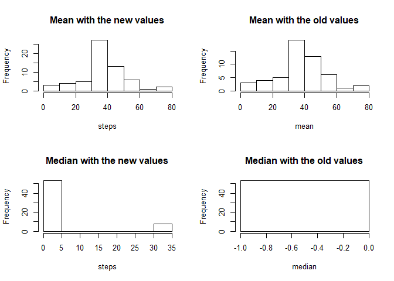

## Loading and preprocessing the data

```r
    library(ggplot2)

    activity <-  read.csv("activity.csv")
    clean_activity <- activity[!is.na(activity$steps),]
```
## What is mean total number of steps taken per day?

```r
    Total_steps <- aggregate(steps ~ date , data = clean_activity, FUN = sum)

    with(Total_steps, hist(steps, col = "Red", main = "Total number of steps taken each day"))
```

<!-- -->

### Mean and Median total number of steps taken per day

```r
    Steps_mean <- aggregate(steps ~ date , data = clean_activity, FUN = mean)
    Steps_median <- aggregate(steps ~ date , data = clean_activity, FUN = median) 
    
    step_day <- merge(Steps_mean, Steps_median, by = "date")
    colnames(step_day)[2:3] <- c("mean","median") 
    
    print(step_day[1:5,])
```

```
##         date     mean median
## 1 2012-10-02  0.43750      0
## 2 2012-10-03 39.41667      0
## 3 2012-10-04 42.06944      0
## 4 2012-10-05 46.15972      0
## 5 2012-10-06 53.54167      0
```


## What is the average daily activity pattern?


```r
    Steps_interval <- aggregate(steps ~ interval , data = clean_activity, FUN = mean)
    with(Steps_interval,  plot(interval, steps, type = "l"))
```

<!-- -->

### Intervals with the maximum number of steps


```r
    print(Steps_interval[order(-Steps_interval$steps)[1:3],])
```

```
##     interval    steps
## 104      835 206.1698
## 105      840 195.9245
## 107      850 183.3962
```


## Imputing missing values

### Total number of missing values


```r
    na_steps <- is.na(activity$steps)
    
    na_total <- sum(na_steps)
    
    print(na_total)
```

```
## [1] 2304
```
   
### The NA's values get replaced with the average of steps daily
    

```r
    na_index <- which(na_steps) ## Get's the index of where the NA's are at

    
    num_cycles <- na_total / length(Steps_interval$steps) ## Divides the amount of NA's between the amount of steps per interval
    intial_Index <- 1
    
    for (counter in c(1:num_cycles)) {    
        
        subs_index <- na_index[intial_Index:(intial_Index+287)]    ## Extract the index to replace
        
        activity[subs_index,"steps"] = Steps_interval[1:288,"steps"]    ## Sets the new values
        
        intial_Index <- intial_Index + 288    ## the next bloc to replace
    }
```


### Data afer the replacement


```r
    Total_steps_NA <- aggregate(steps ~ date , data = activity, FUN = sum)

    par(mfrow= c(1,2))
    with(Total_steps_NA, hist(steps, col = "Red", main = "Data with the new values"))
    
    with(Total_steps, hist(steps, col = "Red", main = "Data with the old values"))
```

<!-- -->


```r
    Steps_mean_NA <- aggregate(steps ~ date , data = activity, FUN = mean)
    Steps_median_NA <- aggregate(steps ~ date , data = activity, FUN = median) 
    
    par(mfrow= c(2,2))

    with(Steps_mean_NA ,hist(steps, main = "Mean with the new values") )
    with(step_day ,hist(mean, main = "Mean with the old values"))
    with(Steps_median_NA ,hist(steps, main = "Median with the new values"))
    with(step_day ,hist(median, main = "Median with the old values"))
```

<!-- -->


## Are there differences in activity patterns between weekdays and weekends?


```r
    activity$date <- as.Date(activity$date,"%Y-%m-%d")
    
    days <- weekdays(activity$date, abbreviate = "TRUE")
    
    weekends <- c("Sun","Sat")
    days[!(days %in% weekends)] <- "weekday"
    days[(days %in% weekends)] <- "weekend"
    
    activity$weekday <- as.factor(days)
    
 
    Steps_week <- aggregate(steps ~ weekday + interval, data = activity, FUN = mean)

    gplot <- ggplot(Steps_week, aes(interval, steps)) + facet_grid(weekday ~ .) + geom_line()

    print(gplot)
```

<!-- -->


